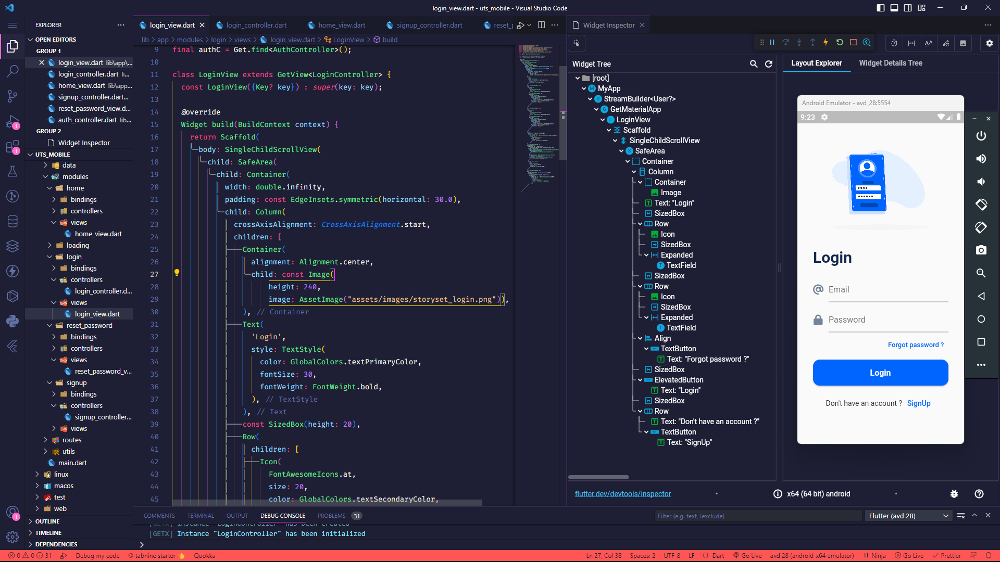

# UTS MOBILE FLUTTER (Login & Register)
**_Nama: Muhammad Akbar_**  
**_Nim : 312110483_**  
**_Kelas : TI.21.A3_**  

 

## Introduction
Ini adalah aplikasi mobile yang di buat menggunakan framework `flutter` dan `firebase`. dengan dibuatnya aplikasi ini yaitu untuk memenuhi tugas UTS Bahasa Pemprograman Mobile 2.

 

## Tech Stack
- Flutter 
- Firebase Authtentication

 

## Features
- Login
- Register
- Forgot Password
- Email Verification

 

## Screenshots
 

### UI Design Figma

  

 

### Login Page

  

 

### Register Page

  

 

### Forgot Password Page

  

 

### Home Page

  

 

### Home Page

  

